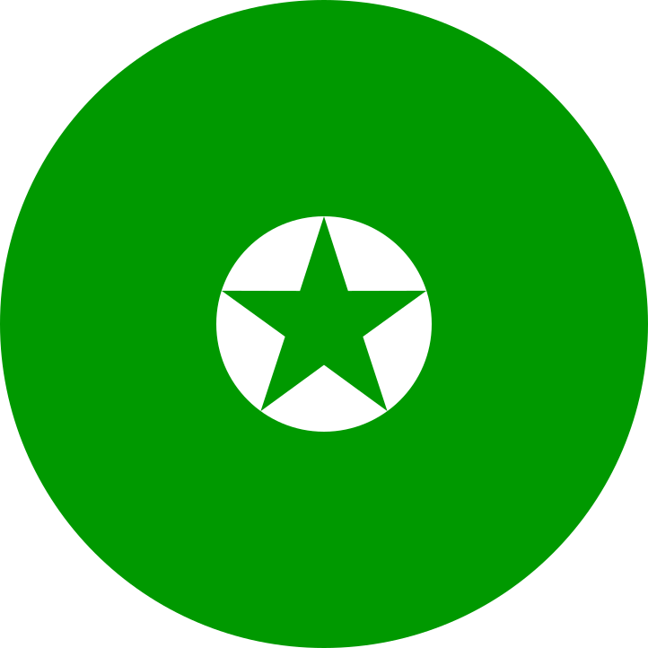

# Esperantaj kokardoj / Esperanto circular flag cockades
Alternate cockade designs for the Esperanto flag / Alternaj kokardoprojektoj por la Esperanta flago

I went on the lookout for a circular Esperanto flag but the ones [that](https://www.pinterest.com/pin/329396160233067907/) [came](https://www.pngegg.com/en/png-scsss) [up](https://www.zazzle.ca/esperanto_quality_flag_circle_2_inch_round_button-145204474472426086) were not very appealing to me, because of the asymmetry. In the vein of other circular flags, were at least all the elements are centered, I decided to design a variant with the star in the middle.

My first idea of having the inscribed star in what would be the inner circle (for three circles of r, 2r and 3r radius) looked decidedly too small. My second idea, of a star with the same area (computed using [this result](https://math.stackexchange.com/questions/753290/area-of-a-five-pointed-star)) of the circle, looked too big. So I made a third variant with a star that circumscribes the circle. (Actually, the pentagon that circumscribes the star also circumscribes the circle.) Then, the idea of having the flag touching the outer green circle, as if it where the spokes of a wheel, presented itself.

I present all of them for your own judgement:

Inscribed | Circumscribed | Same area | Touching
--- | --- | --- | ---
 | |
 |  |  | 

In the end I think I prefer the "circumscribed" design.

Given the preponderance of green in the regular flag, I can see other designs with a thicker outer circle (perhaps comprising the two outer circles and touching the inscribed star?) But on the other hand I like the idea of three equally spaced circles, as most other circular flags do. (E.g., the flag of Spain central band is [twice as thick](https://en.wikipedia.org/wiki/Flag_of_Spain), but not so in the [circular version](https://en.wikipedia.org/wiki/Cockade_of_Spain)).

Well, here it is:

Here are the vectorial source files:

- [esperanto-kokardo-inscribed-star.svg](esperanto-kokardo-inscribed-star.svg)
- [esperanto-kokardo-circumscribed-star.svg](esperanto-kokardo-circumscribed-star.svg)
- [esperanto-kokardo-same-area.svg](esperanto-kokardo-same-area.svg)
- [esperanto-kokardo-touching.svg](esperanto-kokardo-touching.svg)
